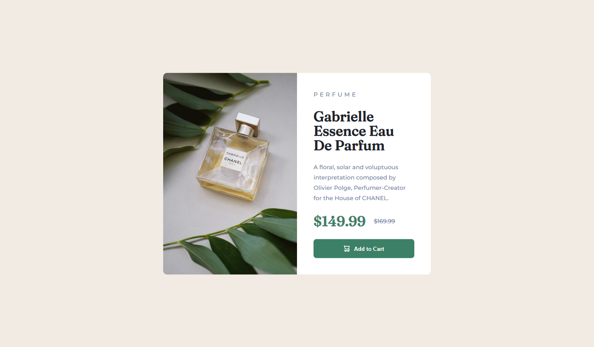
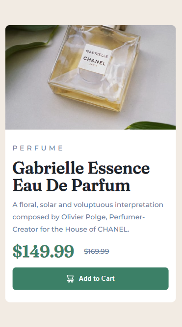

# Frontend Mentor - Product preview card component solution

This is a solution to the [Product preview card component challenge on Frontend Mentor](https://www.frontendmentor.io/challenges/product-preview-card-component-GO7UmttRfa). Frontend Mentor challenges help you improve your coding skills by building realistic projects. 

## Table of contents

- [Overview](#overview)
  - [The challenge](#the-challenge)
  - [Screenshot](#screenshot)
  - [Links](#links)
- [My process](#my-process)
  - [Built with](#built-with)
  - [What I learned](#what-i-learned)
  - [Continued development](#continued-development)
- [Author](#author)

## Overview

### The challenge

Users should be able to:

- View the optimal layout depending on their device's screen size
- See hover and focus states for interactive elements
---
### Screenshot


Desktop View



Mobile View

---
### Links

- Solution URL: [Solution](https://github.com/marshlendel/product-preview-card)
- Live Site URL: [Live Site](https://tangerine-sunburst-d13985.netlify.app)

## My process

### Built with

- Semantic HTML5 markup
- SASS
- Flexbox


### What I learned

I learned that it's easy to get lost in the sauce with flebox and grid and ignore often times simpler solutions. In my case, I was messing around with flex to center the card component exactly in the center of the screen. Because of this I forgot about the simple solution of using display absolute and using position absolute as shown below.
```css
.card-container {
  display: flex;
  flex-wrap: wrap;
  min-height: 60vh;
  width: 40%;
  position: absolute;
  top: 50%;
  left: 50%;
  transform: translate(-50%, -50%);
  border-radius: 1rem;
  overflow: hidden;
}
```


### Continued development

I'd like to explore being more efficient with responsive styles and perhaps if there's a way to not need as many media queries

## Author

- Website - [Marshall Brown](https://sunny-sunburst-5bff07.netlify.app/)
- Frontend Mentor - [@marshlendel](https://www.frontendmentor.io/profile/marshlendel)
- LinkedIn - [marshall-lendel-brown](https://www.linkedin.com/in/marshall-lendel-brown/)
